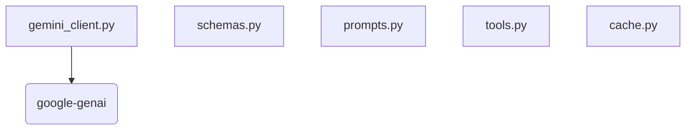

# AI Foundation Architecture

This document describes the foundational AI infrastructure integrating Google Gemini into the Naheed Chatbot, implemented during Phase 1.

## Module Responsibilities

- **`gemini_client.py`**: Wraps the official `google-genai` SDK. Handles API key validation, auth errors, and network failures. Includes retry logic with exponential backoff using `tenacity` and latency logging.
- **`schemas.py`**: Defines all structured data types using Pydantic models (e.g., `IntentResult`, `ToolRequest`, `ToolResponse`, `GeminiResponse`). Ensures strict validation before AI outputs touch business logic.
- **`prompts.py`**: Central repository for all system instructions and few-shot examples (intent extraction, response generation).
- **`tools.py`**: Contains JSON schemas for all permitted tools/functions the LLM can invoke (e.g., `track_order`, `create_complaint`).
- **`cache.py`**: Lightweight, in-memory caching mechanism with configurable TTL to store AI responses and reduce API overhead.

## Dependency Diagram

## Gemini Request Lifecycle

1. **Validation**: API key validated on instantiation.
2. **Execution**: Call `generate_content` passing prompt and optional model.
3. **Resiliency**: If a network failure or 429 occurs, `tenacity` triggers an exponential backoff (up to 3 attempts, max 10-second wait).
4. **Logging**: Captures request initiation, success/failure, and precise latency metrics.
5. **Return**: Returns raw text string.

## Error Handling & Retry Strategy
`GeminiClient` employs the `tenacity` library:
- **Stop Condition**: Max 3 attempts.
- **Wait Strategy**: Exponential backoff starting at 2 seconds, maxing at 10 seconds.
- **Exceptions**: `GeminiAPIError` is raised with context if all retries fail.

## Cache Strategy
`AICache` uses a dictionary-based store keyed by request signatures, validating age against a configurable TTL (default 300 seconds).

## Future Integration Points
In Phase 2, this foundation will power `intent_parser.py`, which will inject `prompts.py` and `schemas.py` into the `gemini_client.py` to route user intents safely.
